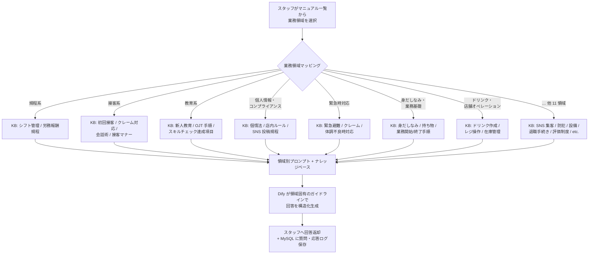
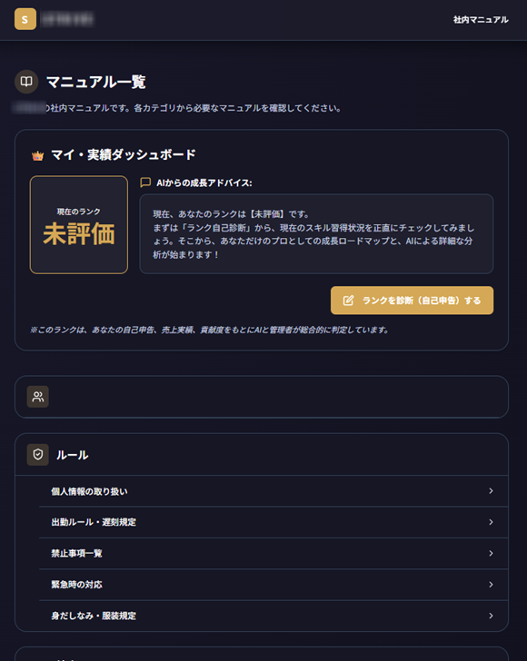
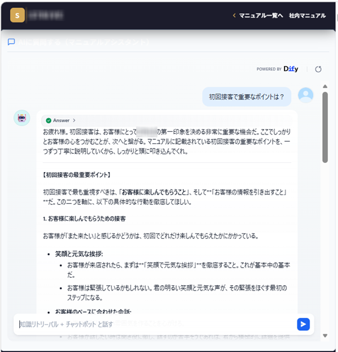
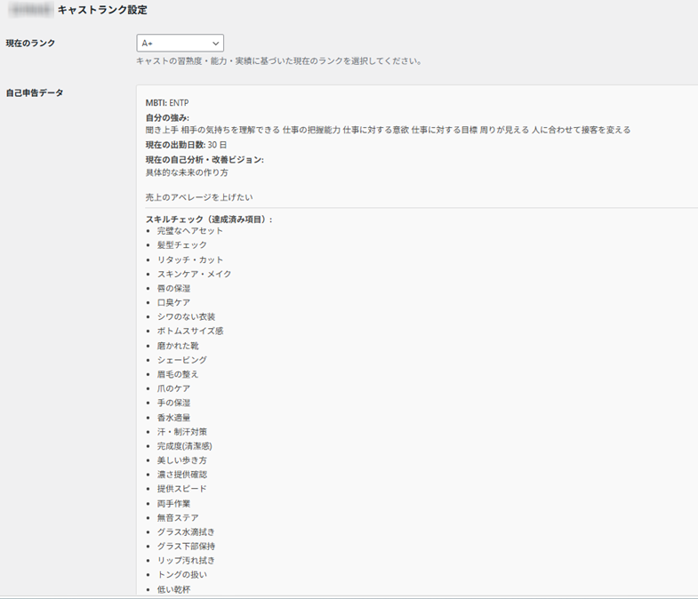

# staff-management-ai-portfolio

**ナイトワーク業界向け 業務マニュアル統合 × スキル評価 × 18 系統 AI チャットボット**のポートフォリオ（動作スクリーンショット集）。

> **Status**: 自社運用中（2026-01 〜 稼働継続）
> **Author**: tanasato — [restartory.com](https://restartory.com)
> **公開範囲**: スクリーンショットのみ（実装コードは NDA 保護のため非公開）

---

## なぜ作ったか

ナイトワーク業界の現場では、業務マニュアルが紙や PDF に分散し、新人スタッフが必要な情報にたどり着けないという課題が常態化していました。「ドリンクの作り方」「初回接客の流れ」「クレーム対応」「個人情報取り扱い」など、業務領域ごとに知識の粒度も対象者も異なるため、単一の検索画面で対応するには限界があります。さらに、各スタッフの習熟度を可視化する仕組みも不足しており、教育担当者が個別に把握する負担が大きい状態でした。

## できること

- **マニュアル統合**: 業務カテゴリごとに分割された約 20 種類のマニュアルを WordPress プラグインから一元管理。スマホからネイティブアプリ感覚で操作できるフルスクリーン UI を実装
- **スキル評価アプリ（83 項目 / 7 領域）**: 「身だしなみ」「ドリンク作成」「初回接客」「SNS 集客」など 7 領域・83 項目のスキルを本人と評価者の両側から S〜C ランクで記録
- **AI チャットボット 18 系統**: 業務領域ごとに知識を分割し、Dify 上で 18 系統のチャットボットを構築。シフト管理・労務報酬規程・緊急時対応など、規程の正確性が求められる領域には個別の回答ガイドラインを設計
- **AI 自己診断**: スタッフの自己申告データ（強み・改善ビジョン・スキルチェック達成済み項目）と管理者評価を AI が総合判定してランクを提示

## 技術スタック

| カテゴリ | 採用技術 |
|---|---|
| 言語 | PHP |
| フレームワーク | WordPress（カスタム投稿タイプ／独自テンプレートローダー／ショートコード） |
| DB / ストレージ | MySQL（WordPress 標準） |
| AI / 外部 API | Dify（AI チャットボット基盤、業務領域別ナレッジベース 18 系統） |
| デプロイ・インフラ | 共用レンタルサーバ（WordPress 稼働環境） |

## アーキテクチャ

```
                  ┌─────────────────────────────────┐
                  │  スタッフ（スマホ・PC からアクセス）│
                  └────────────┬────────────────────┘
                               │ HTTPS
                               ▼
              ┌────────────────────────────────────┐
              │  WordPress（カスタム投稿タイプ）       │
              │  ├ マニュアル統合（フルスクリーン UI） │
              │  ├ スキル評価アプリ（83 項目 / 7 領域）│
              │  └ 独自テンプレートローダー           │
              └────────┬───────────────────┬───────┘
                       │                   │
                       ▼                   ▼
              ┌─────────────┐    ┌──────────────────┐
              │ MySQL（WP 標準）│    │ Dify（AI ボット基盤）│
              │ - 投稿/カテゴリ │    │  ├ 業務領域別 KB    │
              │ - 評価データ   │    │  └ 18 系統チャットボット│
              └─────────────┘    │   ├ 規程系（労務/シフト）│
                                  │   ├ 接客系（初回/クレーム）│
                                  │   └ … 計 18 領域      │
                                  └──────────────────┘
```

[配置の意図]
- 業務領域ごとに 18 系統に分割 → 単一汎用ボットで起きる「規程と接客が混ざって精度劣化」を物理的に避ける
- WordPress 側でフルスクリーン UI を独自テンプレートで実装し、スマホでもネイティブアプリ感覚で操作可能
- Dify はナレッジベース管理 + プロンプト管理 + 18 系統運用を一元化できるため、最小構成で業務要件を満たす

## 18 系統ルーティング（Mermaid）

スタッフが業務質問を入力すると、業務領域メニューから領域を選択 → 該当の Dify ナレッジベース（KB）+ 領域別プロンプトでルーティングされ、領域固有のガイドラインで回答が生成されます。



18 系統の領域分割は「規程の正確性が必要な領域（労務・個情法・緊急時）」と「接客のトーン重視の領域（会話術・初回接客）」を物理的に分けることで、汎用 LLM では起きやすい「文脈混在による回答品質劣化」を防ぐ設計です。

## 動作スクリーンショット

### ① マニュアル一覧 + 実績ダッシュボード

スタッフがログインすると最初に表示されるトップ画面。マイ実績ダッシュボード（AI による成長アドバイス・現在のランク・自己診断ボタン）と、業務領域別マニュアル一覧が並ぶ。



### ② Dify AI チャットボット応答画面

「初回接客で重要なポイントは？」のような業務質問に対し、業務領域別ナレッジに基づいて Dify が回答する例。重要ポイントを構造化して提示し、スタッフが現場で即座に行動指針を確認できる。



### ③ スタッフランク設定 + 自己申告データ

管理者がスタッフのランクを設定する画面。MBTI・強み・出勤日数・改善ビジョン・スキルチェック達成済み項目（83 項目中の達成項目）が一画面で確認でき、AI と管理者の総合判定でランクを決定する。



> **NDA 配慮**: 実店舗で運用中のシステムのため、スクリーンショットは店名・スタッフ名・売上数値をモザイク処理しています。業務内容（マニュアル項目名・スキルチェック項目名）は一般化された運用上の必須要素のため公開しています。

## 工夫点・技術的判断

単一の汎用チャットボットではなく、業務領域ごとに 18 系統を分割した点が最大の特徴です。「規程系」「労務系」「接客系」など、性質の異なる質問を同じモデルに投げると回答品質が劣化するため、ナレッジベースとプロンプトを領域別に最適化しました。WordPress 側もマニュアル系ページのみフルスクリーン化する独自テンプレート判定を実装し、スタッフが現場で即時に開ける UX を実現しています。代替案としてサードパーティの単一チャットボット SaaS も検討しましたが、業務領域別の精度担保と運用コストの両面で自前実装が優位だったため、Dify 18 系統構成を採用しました。

## 成果・指標

| 指標 | Before | After |
|---|---|---|
| マニュアル検索時間 | 紙・PDF 横断検索 約 3 分 | **AI チャット即答 約 15 秒（約 12 倍速）** |
| 評価項目数 | 紙帳票で散在 | **7 領域 / 83 項目を一元管理** |
| AI チャットボット | — | **18 系統（業務領域別に精度担保）** |
| 稼働状態 | — | **本番運用中（2026-01 〜 継続）** |

## この実績が武器になる案件

- **業務マニュアルの社内 AI 化**: 紙・PDF に散在しているマニュアルを統合して即時検索可能にする
- **スキル評価の仕組み化**: 多項目スキルをデータベース化し、AI と人間の両方で評価できるアプリ構築
- **現場スタッフ向け WordPress 業務アプリ**: スマホファーストの業務アプリを WordPress プラグインで構築

特に**現場スタッフが多くマニュアル検索負荷が高い業種**（接客業・小売・飲食・教育業務など）で転用可能。

## 公開について

- 本リポジトリは**ポートフォリオ目的でスクリーンショットのみ公開**しています
- 実装コードは NDA 保護のため非公開
- 同種案件のご相談は [restartory.com](https://restartory.com) のお問い合わせフォームからお願いします

## ライセンス

スクリーンショット内の業務マニュアル文・スキル評価項目・AI 応答は実店舗運用中の知的資産です。商用での流用・転載は禁止します。

---

> **So what** — この実績は「業務マニュアルの社内 AI 化」「多項目スキル評価の仕組み化」「現場スタッフ向け WordPress 業務アプリ構築」案件で武器になる。接客業・小売・飲食・教育業務など**現場スタッフが多くマニュアル検索負荷が高い業種**で転用可能。マニュアル検索 3 分 → AI チャット 15 秒の **約 12 倍速化**を実証している。
